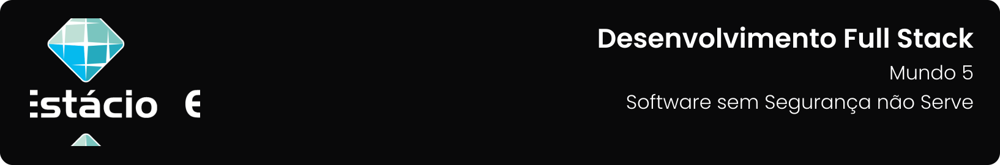

---

[Projeto](#-projeto) • [Como executar](#-como-baixar-e-executar) • [Procedimentos](#-procedimentos) • [Tecnologias utilizadas](#-tecnologias-utilizadas) • [Autor](#-autor) • [Licença](#-licença)

---

## 📋 Projeto

Missão Prática, com o objetivo de dentificar e corrigir vulnerabilidades de segurança em uma API REST, aplicando boas práticas de proteção contra acessos não autorizados e ataques comuns, apresentada no **`Nível 5: Software sem Segurança não Serve`** do **`Mundo 5`** do curso de **`Desenvolvimento Full Stack`** da **`Estácio`**, do semestre de **`2024.4`**.

Projeto elaborado de acordo com as diretrizes especificadas para a Missão Prática, que podem ser conferidas [**`clicando aqui`**](https://sway.cloud.microsoft/s/P89nF9yZ4YctBGSC/embed).

## 📥 Como executar

Para baixar os arquivos deste repositório, você deve ter o GitHub instalado em seu dispositivo.

Após instalado, você deverá acessar a guia `Arquivo` → `Clonar repositório` → `URL` e incluir o caminho `guedesert/software-sem-seguranca-nao-serve`.

Além disso, faz-se necessário ter previamente instalado um IDE, como o [Visual Studio Code](https://code.visualstudio.com/), e um cliente HTTP, como o [Insomnia](https://insomnia.rest/).

## 🔗 Procedimentos

Durante o projeto foram desenvolvidos os procedimentos descritos abaixo:

<table>
  <tr>
    <th>Procedimento</th>
    <th>Descrição</th>
  </tr>
  <tr>
    <td>Configuração do ambiente</td>
    <td>
      <ul>
        <li>Instalar Node.js, npm e bibliotecas necessárias.</li>
        <li>Configurar um banco de dados seguro.</li>
      </ul>
    </td>
  </tr>
  <tr>
    <td>Refatoração da API</td>
    <td>
      <ul>
        <li>Substituir o session-id por tokens JWT.</li>
        <li>Modificar a API para receber o token via header, e não pela URL.</li>
        <li>Implementar validação e expiração do token.</li>
        <li>Criar um endpoint para obter dados do usuário logado.</li>
      </ul>
    </td>
  </tr>
  <tr>
    <td>Melhoria da segurança</td>
    <td>
      <ul>
        <li>Adicionar controle de acesso baseado no perfil do usuário.</li>
        <li>Proteger contra SQL Injection usando consultas parametrizadas.</li>
        <li>Implementar proteção contra CRLF Injection em redirecionamentos.</li>
        <li>Validar dados de entrada para evitar ataques de força bruta.</li>
      </ul>
    </td>
  </tr>
</table>

Para acessar o relatório da Missão Prática, clique no botão abaixo:

## 🛠 Tecnologias utilizadas

Para a construção e execução do projeto foram utilizadas as seguintes tecnologias:

  

## 👥 Autor

| Aluno                                                  | Matrícula    | E-mail                                      |
| ------------------------------------------------------ | ------------ | ------------------------------------------- |
| [Emanuel Roseira Guedes](https://github.com/guedesert) | 202212181407 | [📧](mailto:202212181407@alunos.estacio.br) |

## 📃 Licença

Este repositório está licensiado sob a [Licença MIT](./LICENSE).

